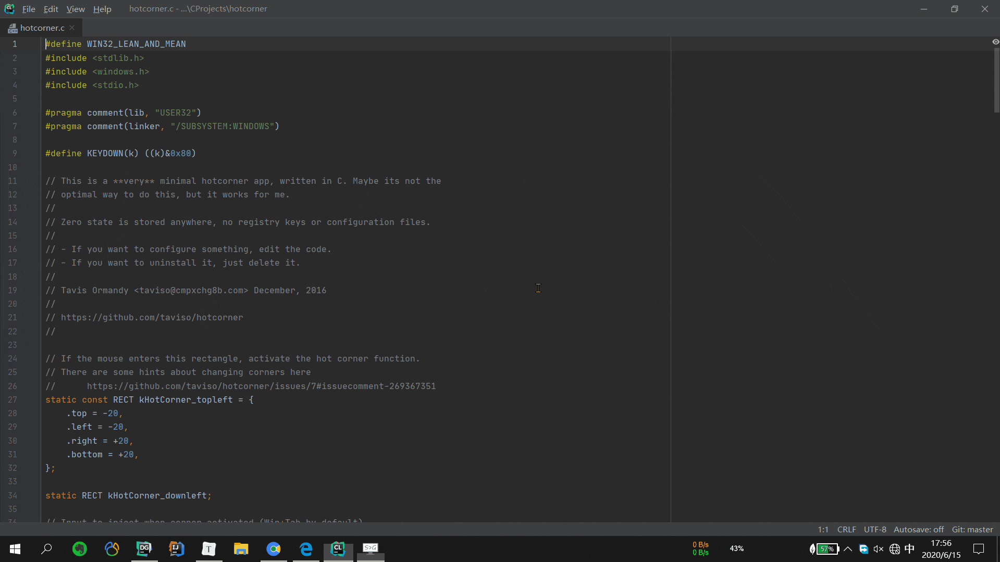

# Tiny Hot Corners for Windows 10

### 文档

[English](https://github.com/misterchaos/hotcorner/blob/Yuchao-Huang/README_En.md)|[中文](https://github.com/misterchaos/hotcorner/blob/Yuchao-Huang/README.md)

### 简介

macOS上有一个很方便的功能：“触发角”。通过这个功能可以设置当鼠标移动到屏幕的四个角时的触发事件，例如触发启动屏幕保护程序等，显示桌面等功能。和我们习惯的热键相对应，macOS将其称之为“Hot Corners(热角)”。笔者接下来要介绍的软件“[**HotCorner**](https://github.com/misterchaos/hotcorner/releases)"就是用于让Windows系统拥有像macOS那样的触发角，实现下面动图展示的效果：

左上角：时间线 <Kbd>Win+Tab</Kbd>
左下角：开始菜单  <Kbd>Win</Kdb>
右上角：通知中心 <Kbd>Win+A</Kbd>
右下角：返回桌面 <Kbd>Win+D</Kbd>

### 软件功能

- 当鼠标移动至屏幕左上角时显示Windows 10时间轴视图
- 当鼠标移动至屏幕右下角时显示Windows 开始菜单

> **在软件运行过程中同时按下Ctrl+Alt+C可以关闭程序**

### License

代码使用GPL3协议进行开源，如需使用代码请遵循CPL3协议相关规定。

### 作者

* Tavis Ormandy [@taviso](https://github.com/taviso/) - Original Author
* Ahmed Samy [@asamy](https://github.com/asamy) - HotKey support
* Yuchao Huang [@misterchaos](https://github.com/misterchaos/) - Application Package

### FAQ

* Q: 我想修改屏幕角触发的事件，怎么办？
* A: 目前只能自己下载源代码进行修改，然后重新编译运行。

* Q: 软件运行之后怎么关闭？
* A: 在软件运行过程中同时按下Ctrl+Alt+C可以关闭程序

* Q: 怎么让软件在开机时运行？
* A: 在安装过程中可以选择`开机启动`，如果安装时没有选择，可以手动实现（方法自己百度即可）
